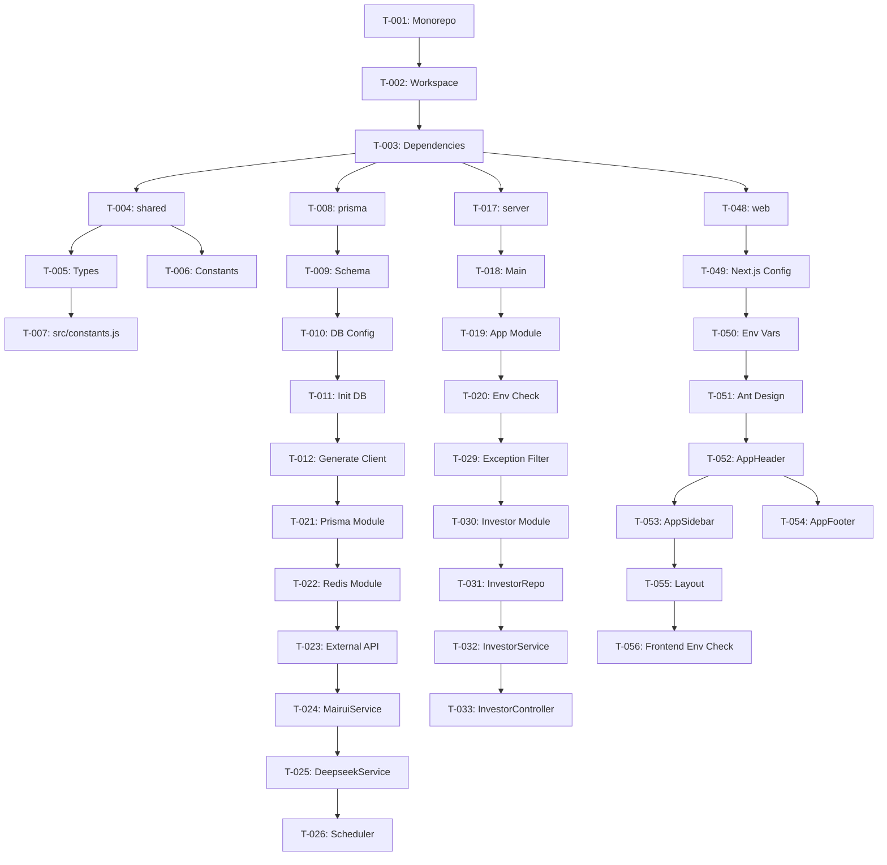

# King 财经数据平台 - 任务清单

> **文档版本**: v1.0
> **创建日期**: 2026-04-17
> **基于 PRD**: King项目一期PRD (4).md

---

## 任务清单说明

- **状态**: 待办、进行中、已完成、已阻塞、已取消
- **优先级**: P0（核心功能）、P1（重要功能）、P2（增强功能）、P3（可选功能）
- **估时**: 单位为小时（h）
- **依赖**: 前置任务编号

---

## 第一批：项目骨架

### 任务组 1.1：Monorepo 初始化

| 编号 | 任务名称 | 描述 | 优先级 | 估时 | 依赖 | 状态 |
|-----|---------|------|-------|------|------|------|
| T-001 | 创建 Monorepo 结构 | 初始化 pnpm workspace，创建 package.json | P0 | 1h | - | 待办 |
| T-002 | 配置工作区 | 创建 pnpm-workspace.yaml，定义 packages/apps 结构 | P0 | 0.5h | T-001 | 待办 |
| T-003 | 安装基础依赖 | 安装 TypeScript、ESLint、Prettier 等开发工具 | P0 | 1h | T-002 | 待办 |

### 任务组 1.2：packages/shared 共享包

| 编号 | 任务名称 | 描述 | 优先级 | 估时 | 依赖 | 状态 |
|-----|---------|------|-------|------|------|------|
| T-004 | 创建 shared 包 | 初始化 packages/shared，配置 package.json | P0 | 0.5h | T-003 | 待办 |
| T-005 | 定义共享类型 | 创建 types/investor.ts, stock.ts, holding.ts, article.ts, api.ts | P0 | 2h | T-004 | 待办 |
| T-006 | 创建常量文件 | 创建 constants/quarter.ts, format.ts（数字、百分比格式化） | P0 | 1.5h | T-005 | 待办 |
| T-007 | 创建 src/constants.js | 统一术语常量（RESPONSE_CODE, USER_ROLE, PAGINATION 等） | P0 | 2h | T-006 | 待办 |

### 任务组 1.3：packages/prisma 包

| 编号 | 任务名称 | 描述 | 优先级 | 估时 | 依赖 | 状态 |
|-----|---------|------|-------|------|------|------|
| T-008 | 创建 prisma 包 | 初始化 packages/prisma，配置 package.json | P0 | 0.5h | T-003 | 待办 |
| T-009 | 定义 Prisma Schema | 创建 schema.prisma，定义 20 个模型（User, Investor, Holding, Stock 等） | P0 | 3h | T-008 | 待办 |
| T-010 | 配置数据库连接 | 创建 .env 文件，配置 DATABASE_URL | P0 | 0.5h | T-009 | 待办 |
| T-011 | 初始化数据库 | 运行 prisma db push 创建表结构 | P0 | 0.5h | T-010 | 待办 |
| T-012 | 生成 Prisma Client | 运行 prisma generate | P0 | 0.5h | T-011 | 待办 |

### 任务组 1.4：Docker Compose 配置

| 编号 | 任务名称 | 描述 | 优先级 | 估时 | 依赖 | 状态 |
|-----|---------|------|-------|------|------|------|
| T-013 | 创建 docker-compose.yml | 配置 PostgreSQL、Redis、server、web 四个服务 | P0 | 1.5h | - | 待办 |
| T-014 | 创建 server Dockerfile | 配置 Node.js 20 + pnpm + 多阶段构建 | P0 | 1h | T-013 | 待办 |
| T-015 | 创建 web Dockerfile | 配置 Next.js 构建和启动 | P0 | 1h | T-013 | 待办 |
| T-016 | 测试 Docker 环境 | 启动 docker-compose up，验证服务连通性 | P0 | 1h | T-014, T-015 | 待办 |

### 任务组 1.5：NestJS 后端骨架

| 编号 | 任务名称 | 描述 | 优先级 | 估时 | 依赖 | 状态 |
|-----|---------|------|-------|------|------|------|
| T-017 | 创建 server 包 | 初始化 apps/server，配置 package.json | P0 | 0.5h | T-003 | 待办 |
| T-018 | 创建 NestJS 主入口 | 创建 main.ts，配置 NestFactory | P0 | 1h | T-017 | 待办 |
| T-019 | 创建根模块 | 创建 app.module.ts，注册全局模块 | P0 | 1h | T-018 | 待办 |
| T-020 | 添加环境自检 | 在 main.ts 顶部添加 checkEnvironment() 函数 | P0 | 1h | T-019 | 待办 |

### 任务组 1.6：Infrastructure 层

| 编号 | 任务名称 | 描述 | 优先级 | 估时 | 依赖 | | 状态 |
|-----|---------|------|-------|------|------|------|
| T-021 | 创建 Prisma 模块 | infrastructure/prisma/prisma.module.ts, prisma.service.ts | P0 | 1h | T-012 | 待办 |
| T-022 | 创建 Redis 模块 | infrastructure/redis/redis.module.ts, redis.service.ts | P0 | 1.5h | T-016 | 待办 |
| T-023 | 创建 External API 模块 | infrastructure/external-api/ 模块结构 | P0 | 0.5h | T-022 | 待办 |
| T-024 | 实现 MairuiService | mairui.service.ts，封装股票列表、行情、股东数据 API | P0 | 3h | T-023 | 待办 |
| T-025 | 实现 DeepseekService | deepseek.service.ts，封装主营业务生成 API | P1 | 1.5h | T-024 | 待办 |
| T-026 | 创建 Scheduler 模块 | infrastructure/scheduler/ 模块结构 | P0 | 0.5h | T-025 | 待办 |

### 任务组 1.7：全局异常处理

| 编号 | 任务名称 | 描述 | 优先级 | 估时 | 依赖 | 状态 |
|-----|---------|------|-------|------|------|------|
| T-027 | 创建 ExternalApiError | common/filters/external-api.error.ts | P0 | 0.5h | - | 待办 |
| T-028 | 创建 HttpExceptionFilter | common/filters/http-exception.filter.ts | P0 | 1.5h | T-027 | 待办 |
| T-029 | 注册全局过滤器 | 在 main.ts 中注册 AllExceptionsFilter | F0 | 0.5h | T-028 | 待办 |

---

## 第二批：核心领域

### 任务组 2.1：Investor 模块

| 编号 | 任务名称 | 描述 | 优先级 | 估时 | 依赖 | 状态 |
|-----|---------|------|-------|------|------|------|
| T-030 | 创建 Investor 模块结构 | domain/investor/ 目录和文件 | P0 | 0.5h | T-029 | 待办 |
| T-031 | 实现 InvestorRepository | investor.repository.ts，单表 CRUD | P0 | 2h | T-030 | 待办 |
| T-032 | 实现 InvestorService | investor.service.ts，业务逻辑 | P0 | 3h | T-031 | 待办 |
| T-033 | 实现 InvestorController | investor.controller.ts，路由定义 | P0 | 2h | T-032 | 待办 |
| T-034 | 创建 DTO 文件 | create-investor.dto.ts, update-investor.dto.ts, query-investor.dto.ts | P0 | 1h | T-030 | 待办 |

### 任务组 2.2：Stock 模块

| 编号 | 任务名称 | 描述 | 优先级 | 估时 | 依赖 | 状态 |
|-----|---------|------|-------|------|------|------|
| T-035 | 创建 Stock 模块结构 | domain/stock/ 目录和文件 | P0 | 0.5h | T-029 | 待办 |
| T-036 | 实现 StockRepository | stock.repository.ts | P0 | 1.5h | T-035 | 待办 |
| T-037 | 实现 StockService | stock.service.ts | P0 | 2h | T-036 | 待办 |
| T-038 | 实现 StockController | stock.controller.ts，包含市场概览接口 | P0 | 2h | T-037 | 待办 |

### 任务组 2.3：Holding 模块

| 编号 | 任务名称 | 描述 | 优先级 | 估时 | 依赖 | 状态 |
|-----|---------|------|-------|------|------|------|
| T-039 | 创建 Holding 模块结构 | domain/holding/ 目录和文件 | P0 | 0.5h | T-029 | 待办 |
| T-040 | 实现 HoldingRepository | holding.repository.ts | P0 | 2h | T-039 | 待办 |
| T-041 | 实现 HoldingService | holding.service.ts，实现增持/减持/新进/共同持仓逻辑 | P0 | 5h | T-040 | 待办 |
| T-042 | 实现 HoldingController | holding.controller.ts，四个 VIP 接口 | P0 | 2h | T-041 | 待办 |

### 任务组 2.4：JWT 认证

| 编号 | 任务名称 | 描述 | 优先级 | 估时 | 依赖 | 状态 |
|-----|---------|------|-------|------|------|------|
| T-043 | 创建 JwtModule 配置 | config/jwt.strategy.ts | P0 | 1.5h | T-019 | 待办 |
| T-044 | 创建 JwtAuthGuard | common/guards/jwt-auth.guard.ts | P0 | 0.5h | T-043 | 待办 |
| T-045 | 创建 AdminGuard | common/guards/admin.guard.ts | P0 | 0.5h | T-044 | 待办 |
| T-046 | 创建 VipGuard | common/guards/vip.guard.ts | P0 | 1h | T-044 | 待办 |
| T-047 | 创建 Auth 模块 | domain/auth/ 模块结构，实现登录接口 | P0 | 2h | T-045 | 待办 |

---

## 第三批：前端骨架

### 任务组 3.1：Next.js 初始化

| 编号 | 任务名称 | 描述 | 优先级 | 估时 | 依赖 | 状态 |
|-----|---------|------|-------|------|------|------|
| T-048 | 创建 web 包 | 初始化 apps/web，配置 package.json | P0 | 0.5h | T-003 | 待办 |
| T-049 | 配置 Next.js | next.config.js，配置 API 代理 | P0 | 1h | T-048 | 待办 |
| T-050 | 配置环境变量 | .env.local，设置 NEXT_PUBLIC_API_URL | P0 | 0.5h | T-049 | 待办 |
| T-051 | 配置 Ant Design | antd 主题、全局样式 | P0 | 1h | T-050 | 待办 |

### 任务组 3.2：全局布局

| 编号 | 任务名称 | 描述 | 优先级 | 估时 | 依赖 | 状态 |
|-----|---------|------|-------|------|------|------|
| T-052 | 创建 AppHeader | components/layout/AppHeader.tsx | P0 | 2h | T-051 | 待办 |
| T-053 | 创建 AppSidebar | components/layout/AppSidebar.tsx | P0 | 2h | T-052 | 待办 |
| T-054 | 创建 AppFooter | components/layout/AppFooter.tsx | P0 | 0.5h | T-052 | 待办 |
| T-055 | 创建根布局 | app/layout.tsx，组装 Header/Sider/Footer | P0 | 1h | T-053, T-054 | 待办 |
| T-056 | 添加前端环境自检 | 在 layout.tsx 中添加环境变量检查代码 | P0 | 1h | T-055 | 待办 |

### 任务组 3.3：API 客户端与 Hooks

| 编号 | 任务名称 | 描述 | 优先级 | 估时 | 依赖 | 状态 |
|-----|---------|------|-------|------|------|------|
| T-057 | 创建 API 客户端 | lib/api.ts，配置 axios 实例、请求/响应拦截器 | P0 | 2h | T-056 | 待办 |
| T-058 | 创建 Token 管理 | lib/auth.ts，实现 getToken/setToken/removeToken | P0 | 1h | T-057 | 待办 |
| T-059 | 创建 useInvestors Hook | hooks/useInvestors.ts | P0 | 1.5h | T-057 | 待办 |
| T-060 | 创建 useTopGainers Hook | hooks/useTopGainers.ts | P0 | 1h | T-059 | 待办 |
| T-061 | 创建 useArticles Hook | hooks/useArticles.ts | P0 | 1h | T-059 | 待办 |

### 任务组 3.4：首页

| 编号 | 任务名称 | 描述 | 优先级 | 估时 | 依赖 | 状态 |
|-----|---------|------|-------|------|------|------|
| T-062 | 创建首页路由 | app/page.tsx | P0 | 1h | T-056 | 待办 |
| T-063 | 实现首页布局 | 功能模块入口、牛散排行榜、文章列表 | P0 | 3h | T-062 | 待办 |
| T-064 | 实现首页数据聚合 | Promise.all 并行请求 | P0 | 1h | T-063 | 待办 |

### 任务组 3.5：牛散页面

| 编号 | 任务名称 | 描述 | 优先级 | 估时 | 依赖 | 状态 |
|-----|---------|------|-------|------|------|------|
| T-065 | 创建牛散列表页 | app/investors/page.tsx | P0 | 2h | T-056 | 待办 |
| T-066 | 创建牛散详情页 | app/investors/[id]/page.tsx | P0 | 3h | T-065 | 待办 |
| T-067 | 创建持仓饼图组件 | components/charts/PieChart.tsx | P0 | 1.5h | T-066 | 待办 |

---

## 第四批：剩余后端模块

### 任务组 4.1：Article 模块

| 编号 | 任务名称 | 描述 | 优先级 | 估时 | 依赖 | 状态 |
|-----|---------|------|-------|------|------|------|
| T-068 | 创建 Article 模块 | domain/article/ 完整模块 | P0 | 4h | T-029 | 待办 |

### 任务组 4.2：Dividend 模块

| 编号 | 任务名称 | 描述 | 优先级 | 估时 | 依赖 | 状态 |
|-----|---------|------|-------|------|------|------|
| T-069 | 创建 Dividend 模块 | domain/dividend/ 完整模块 | P1 | 3.5h | T-029 | 待办 |

### 任务组 4.3：Executive 模块

| 编号 | 任务名称 | 描述 | 优先级 | 估时 | 依赖 | 状态 |
|-----|---------|------|-------|------|------|------|
| T-070 | 创建 Executive 模块 | domain/executive/ 完整模块 | P1 | 3h | T-029 | 待办 |

### 任务组 4.4：TopGainer 模块

| 编号 | 任务名称 | 描述 | 优先级 | 估时 | 依赖 | 状态 |
|-----|---------|------|-------|------|------|------|
| T-071 | 创建 TopGainer 模块 | domain/top-gainer/ 完整模块 | P0 | 4h | T-029 | 待办 |

### 任务组 4.5：Search 模块

| 编号 | 任务名称 | 描述 | 优先级 | 估时 | 依赖 | 状态 |
|-----|---------|------|-------|------|------|------|
| T-072 | 创建 Search 模块 | domain/search/ 完整模块 | P1 | 2h | T-029 | 待办 |

### 任务组 4.6：定时同步任务

| 编号 | 任务名称 | 描述 | 优先级 | 估时 | 依赖 | 状态 |
|-----|---------|------|-------|------|------|------|
| T-073 | 实现 BaseSyncTask | infrastructure/scheduler/base-sync.task.ts | P0 | 1.5h | T-026 | 待办 |
| T-074 | 实现 StockSyncTask | stock-sync.task.ts，股票列表、实时行情、涨停板同步 | P0 | 4h | T-073 | 待办 |
| T-075 | 实现 KlineSyncTask | kline-sync.task.ts，K 线数据同步、历史涨幅预计算 | P0 | 3h | T-073 | 待办 |
| T-076 | 注册定时任务 | 在 sync.module.ts 中注册所有同步任务 | P0 | 1h | T-075 | 待办 |

### 任务组 4.7：个人股东模块

| 编号 | 任务名称 |）描述 | 优先级 | 估时 | 依赖 | 状态 |
|-----|---------|------|-------|------|------|------|
| T-077 | 创建 IndividualShareholder 模块 | domain/individual-shareholder/ 完整模块 | P1 | 3h | T-029 | 待办 |

### 任务组 4.8：同步管理

| 编号 | 任务名称 | 描述 | 优先级 | 估时 | 依赖 | 状态 |
|-----|---------|------|-------|------|------|------|
| T-078 | 实现同步管理接口 | domain/admin/sync-logs 相关接口 | P1 | 2h | T-076 | 待办 |

---

## 第五批：剩余前端页面

### 任务组 5.1：涨幅榜

| 编号 | 任务名称 | 描述 | 优先级 | 估时 | 依赖 | 状态 |
|-----|---------|------|-------|------|------|------|
| T-079 | 创建涨幅榜页面 | app/top-gainers/page.tsx | P0 | 3h | T-056 | 待办 |
| T-080 | 创建迷你走势图组件 | components/charts/SparklineChart.tsx | P1 | 1.5h | T-079 | 待办 |

### 任务组 5.2：牛散相关页面

| 编号 | 任务名称 | 描述 | 优先级 | 估时 | 依赖 | 状态 |
|-----|---------|------|-------|------|------|------|
| T-081 | 创建共同持仓页面 | app/common-holdings/page.tsx | P0 | 2.5h | T-056 | 待办 |
| T-082 | 创建增持页面 | app/investor-increase/page.tsx | P0 | 2h | T-056 | 待办 |
| T-083 | 创建减持页面 | app/investor-decrease/page.tsx | P0 | 2h | T-056 | 待办 |
| T-084 | 创建新进页面 | app/investor-new/page.tsx | P0 | 2h | T-056 | 待办 |

### 任务组 5.3：其他功能页面

| 编号 | 任务名称 | 描述 | 优先级 | 估时 | 依赖 | 状态 |
|-----|---------|------|-------|------|------|------|
| T-085 | 创建高管增持页面 | app/executive-increase/page.tsx | P1 | 2h | T-056 | 待办 |
| T-086 | 创建十大增持页面 | app/top-increase/page.tsx | P1 | 2h | T-056 | 待办 |
| T-087 | 创建分红股息率页面 | app/dividend-yield/page.tsx | P1 | 2.5h | T-056 | 待办 |
| T-088 | 创建个人股东页面 | app/individual-shareholders/page.tsx | P1 | 2h | T-056 | 待办 |
| T-089 | 创建巴菲特持仓页面 | app/buffett-holdings/page.tsx | P1 | 1.5h | T-056 | 待办 |
| T-090 | 创建木头姐持仓页面 | app/arkk-holdings/page.tsx | P1 | 1.5h | T-056 | 待办 |

### 任务组 5.4：管理后台

| 编号 | 任务名称 | 描述 | 优先级 | 估时 | 依赖 | 状态 |
|-----|---------|------|-------|------|------|------|
| T-091 | 创建管理后台布局 | app/admin/layout.tsx | P1 | 1.5h | T-056 | 待办 |
| T-092 | 创建登录页面 | app/login/page.tsx | P1 | 1.5h | T-056 | 待办 |
| T-093 | 创建管理后台首页 | app/admin/page.tsx | P1 | 2h | T-091 | 待办 |
| T-094 | 创建牛散管理页面 | app/admin/investors/page.tsx | P1 | 2h | T-093 | 待办 |
| T-095 | 创建文章管理页面 | app/admin/articles/page.tsx | P1 | 2h | T-093 | 待办 |
| T-096 | 创建同步管理页面 | app/admin/sync/page.tsx | P1 | 2h | T-093 | 待办 |

---

## 第六批：体验增强

### 任务组 6.1：主题系统

| 编号 | 任务名称 | 描述 | 优先级 | 估时 | 依赖 | 状态 |
|-----|---------|------|-------|------|------|------|
| T-097 | 实现主题配置 | components/lib/theme.ts | P1 | 1.5h | T-056 | 待办 |
| T-098 | 创建主题切换组件 | components/layout/ThemeSwitcher.tsx | P1 | 1h | T-097 | 待办 |

### 任务组 6.2：通用组件

| 编号 | 任务名称 | 描述 | 优先级 | 估时 | 依赖 | 状态 |
|-----|---------|------|-------|------|------|------|
| T-099 | 创建异步内容组件 | components/common/AsyncContent.tsx | P1 | 1.5h | T-056 | 待办 |
| T-100 | 创建分享模态框 | components/common/ShareModal.tsx | P2 | 1h | T-099 | 待办 |
| T-101 | 创建面包屑导航 | components/layout/AppBreadcrumb.tsx | P1 | 1.5h | T-099 | 待办 |

### 任务组 6.3：股票相关组件

| 编号 | 任务名称 | 描述 | 优先级 | 估时 | 依赖 | 状态 |
|-----|---------|------|-------|------|------|------|
| T-102 | 创建股票表格组件 | components/stock/StockTable.tsx | P1 | 2h | T-099 | 待办 |
| T-103 | 创建股票搜索组件 | components/stock/StockSearch.tsx | P1 | 1.5h | T-102 | 待办 |
| T-104 | 创建自选股卡片 | components/stock/WatchlistCard.tsx | P2 | 1.5h | T-103 | 待办 |

### 任务组 6.4：牛散相关组件

| 编号 | 任务名称 | 描述 | 优先级 | 估时 | 依赖 | 状态 |
|-----|---------|------|-------|------|------|------|
| T-105 | 创建牛散卡片组件 | components/investor/InvestorCard.tsx | P1 | 1h | T-099 | 待办 |
| T-106 | 创建牛散表格组件 | components/investor/InvestorTable.tsx | P1 | 1.5h | T-105 | 待办 |
| T-107 | 创建持仓表格组件 | components/investor/HoldingTable.tsx | P1 | 2h | T-106 | 待办 |

---

## 商业化功能（二期）

### 任务组 7.1：VIP 付费墙

| 编号 | 任务名称 | 描述 | 优先级 | 估时 | 依赖 | 状态 |
|-----|---------|------|-------|------|------|------|
| T-108 | 创建付费墙组件 | components/paywall/VipPaywall.tsx | P2 | 2h | T-056 | 待办 |
| T-109 | 创建定价页面 | app/pricing/page.tsx | P2 | 1.5h | T-108 | 待办 |

### 任务组 7.2：支付集成

| 编号 | 任务名称 | 描述 | 优先级 | 估时 | 依赖 | 状态 |
|-----|---------|------|-------|------|------|------|
| T-110 | 创建支付模块 | domain/payment/ 完整模块 | P2 | 4h | T-047 | 待办 |
| T-111 | 创建订单模块 | domain/order/ 完整模块 | P2 | 3h | T-110 | 待办 |

### 任务组 7.3：用户功能

| 编号 | 任务名称 | 描述 | 优先级 | 估时 | 依赖 | 状态 |
|-----|---------|------|-------|------|------|------|
| T-112 | 创建自选股模块 | domain/watchlist/ 完整模块 | P2 | 3h | T-047 | 待办 |
| T-113 | 创建价格提醒模块 | domain/price-alert/ 完整模块 | P2 | 3.5h | T-112 | 待办 |
| T-114 | 创建通知模块 | domain/notification/ 完整模块 | P2 | 2h | T-113 | 待办 |
| T-115 | 创建个人中心 | domain/account/ 完整模块 | P2 | 2.5h | T-114 | 待办 |
| T-116 | 创建收藏模块 | domain/favorite/ 完整模块 | P2 | 2h | T-115 | 待办 |

---

## 统计信息

### 任务统计

| 批次 | 任务数量 | 总估时 | 状态 |
|-----|---------|-------|------|
| 第一批：项目骨架 | 29 | 26h | 待办 |
| 第二批：核心领域 | 18 | 24.5h | 待办 |
| 第三批：前端骨架 | 16 | 22h | 待办 |
| 第四批：剩余后端 | 10 | 23.5h | 待待 |
| 第五批：剩余前端 | 18 | 29h | 待办 |
| 第六批：体验增强 | 11 | 16.5h | 待办 |
| 第七批：商业化功能 | 9 | 20.5h | 待办 |
| **总计** | **111** | **162h** | **待办** |

### 优先级统计

| 优先级 | 任务数量 | 占比 |
|-------|---------|------|
| P0 | 52 | 46.8% |
| P1 | 39 | 35.1% |
| P2 | 20 | 18.0% |
| P3 | 0 | 0% |

### 预估工期

| 开发模式 | 每日工时 | 总工期 |
|---------|---------|-------|
| 标准开发（1人） | 8h | 20.25 天（约 4 周） |
| 高效开发（1人） | 10h | 16.2 天（约 3.2 周） |
| 双人开发 | 16h | 10.1 天（约 2 周） |
| 三人开发 | 24h | 6.75 天（约 1.5 周） |

---

## 依赖关系图

---

## 注意事项

1. **任务执行顺序**: 严格按照依赖关系执行，先行任务完成后才能开始后续任务
2. **估时说明**: 估时为理想情况下的开发时间，实际开发中应预留 20% 缓冲
3. **并行开发**: 无依赖关系的任务可以并行开发，如不同模块的 Repository/Service/Controller
4. **文档同步**: 每完成一个任务，应更新任务状态为"已完成"
5. **测试要求**: P0 任务完成后应进行单元测试和集成测试
